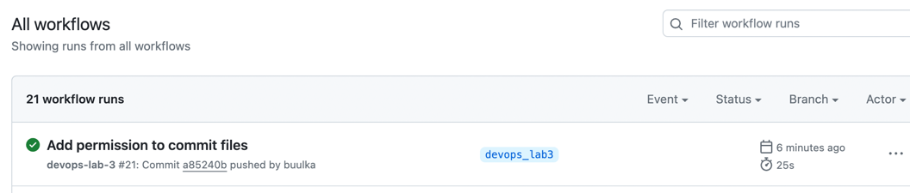

# Devops-лабораторная работа №3 

## Цель
Сделать, чтобы после пуша в ваш репозиторий автоматически собирался 
докер образ и результат его сборки сохранялся куда-нибудь. 
(например, если результат - текстовый файлик, он должен автоматически сохраниться на локальную машину, 
в ваш репозиторий или на ваш сервер).

## Ход работы

### Создание Dockerfile

Создаем самый простой Dockerfile, в котором копируем файл `main.py` и запускаем его

В `main.py` происходит создание текстового файла с пожеланием хорошего дня :)

```dockerfile
FROM python:3.9

WORKDIR /app
COPY devops_lab3/main.py .

ENTRYPOINT ["python", "main.py"]
``` 

### Подключение Github Actions и конфигурация yaml-файла

Создаем директорию `.github` в нашем проекте, в ней создаем директорию `workflows` с файлом `pipeline.yaml`

Выдаем разрешение на пуш в репозиторий

```yaml
permissions:
contents: write
```

Настраиваем запуск github actions по пушу в ветку `devops_lab3`
```yaml
on:
  push:
    branches:
      - devops_lab3
```

Создаем джобу `build-docker-image` на базе ubuntu

```yaml
jobs:
  build-docker-image:
    runs-on: ubuntu-latest
```

Далее расписываем шаги нашего action

1. Собираем Docker image 

```yaml
name: Build the Docker image
run: docker build -t devops_lab3 .
```

2. Запускаем Docker контейнер

```yaml
name: Run Docker container
run: docker run --name temp_container -t devops_lab3
```

3. Перемещаем созданный текстовый файл из контейнера в вокрспэйс гитхаба

```yaml
name: Replace text file
run: docker cp temp_container:app/wish.txt $GITHUB_WORKSPACE
```

4. Удаляем наш запущенный контейнер

```yaml
name: Remove the container
run: docker rm --force temp_container

```

5. Коммитим скопированный текстовый файл и делаем пуш в репозиторий

```yaml
name: Commit the result file
run: |
git config --global user.name 'github-actions bot'
git config --global user.email 'katenika158@gmail.com'
git remote set-url origin https://x-access-token:${{ secrets.GITHUB_TOKEN }}@github.com/${{ github.repository }}
git add wish.txt
git commit -m "Publish result file"
git push
```

## Результат

По любому пушу в ветку `devops_lab3` запускается github actions, который создает docker-образ и запускает docker-контейнер

В контейнере отрабатывает простой скрипт, который создает текстовый файл 

После отработки скрипта контейнер останавливается и удаляется, а текстовый файл пушится в репозиторий




